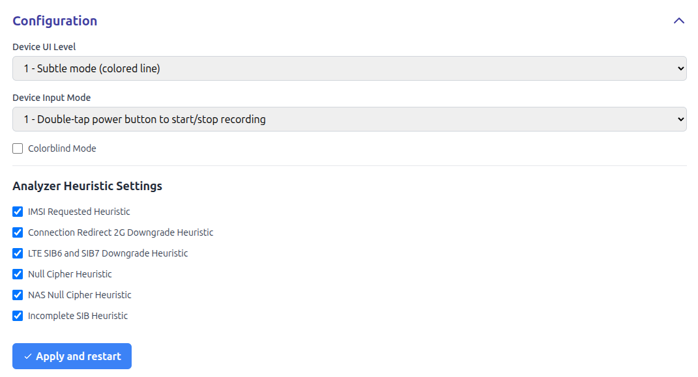

# Configuration

Rayhunter can be configured through web user interface or by editing `/data/rayhunter/config.toml` on the device.



Through web UI you can set:
- **Device UI Level**, which defines what Rayhunter shows on device's built-in screen. *Device UI Level* could be:
  - *Invisible mode*: Rayhunter does not show anything on the built-in screen
  - *Subtle mode (colored line)*: Rayhunter shows green line if there are no warnings, red line if there are warnings (warnings could be checked through web UI) and white line if Rayhunter is not recording.
  - *Demo mode (orca gif)*, which shows image of orcas *and* colored line.
  - *EFF logo*, which shows EFF logo *and* colored line.
  - *High visibility (full screen color)*: fills the entire screen with the status color (green for recording, red for warnings, white for paused).
- **Device Input Mode**, which defines behavior of built-in power button of the device. *Device Input Mode* could be:
  - *Disable button control*: built-in power button of the device is not used by Rayhunter.
  - *Double-tap power button to start new recording*: double clicking on a built-in power button of the device stops and immediately restarts the recording. This could be useful if Rayhunter's heuristics is triggered and you get the red line, and you want to "reset" the past warnings. Normally you can do that through web UI, but sometimes it is easier to double tap on power button.
- **Colorblind Mode** enables color blind mode (blue line is shown instead of green line, red line remains red). Please note that this does not cover all types of color blindness, but switching green to blue should be about enough to differentiate the color change for most types of color blindness.
- **ntfy URL**, which allows setting a [ntfy](https://ntfy.sh/) URL to which notifications of new detections will be sent. The topic should be unique to your device, e.g., `https://ntfy.sh/rayhunter_notifications_ba9di7ie` or `https://myserver.example.com/rayhunter_notifications_ba9di7ie`. The ntfy Android and iOS apps can then be used to receive notifications. More information can be found in the [ntfy docs](https://docs.ntfy.sh/).
- **Enabled Notification Types** allows enabling or disabling the following types of notifications:
  - *Warnings*, which will alert when a heuristic is triggered. Alerts will be sent at most once every five minutes.
  - *Low Battery*, which will alert when the device's battery is low. Notifications may not be supported for all devices—you can check if your device is supported by looking at whether the battery level indicator is functioning on the System Information section of the Rayhunter UI.
- With **Analyzer Heuristic Settings** you can switch on or off built-in [Rayhunter heuristics](heuristics.md). Some heuristics are experimental or can trigger a lot of false positive warnings in some networks (our tests have shown that some heuristics have different behavior in US or European networks). In that case you can decide whether you would like to have the heuristics that trigger a lot of false positives on or off. Please note that we are constantly improving and adding new heuristics, so a new release may reduce false positives in existing heuristics as well.

## WiFi Client Mode

On the **Orbic**, **Moxee**, **UZ801**, **TMOHS1**, and **Wingtech**, Rayhunter can connect the device to an existing WiFi network while keeping the hotspot running. This gives the device internet access for [notifications](https://docs.ntfy.sh/) and lets you reach the web UI from any device on that network.

- **Enable WiFi** turns WiFi client mode on or off. Disabling it does not erase saved credentials.
- **Scan** searches for nearby networks. Select one from the dropdown, or type an SSID manually.
- **Password** is required for WPA/WPA2 networks. The password is stored separately from `config.toml` (in `wpa_sta.conf` on the device) and is never exposed through the API.
- **DNS Servers** lets you override the DNS servers used when connected. Defaults to `9.9.9.9` and `149.112.112.112` (Quad9) if not set.

After saving, the connection status will show **connecting**, **connected** (with the assigned IP address), or **failed** (with an error message). If the connection fails, check that the SSID and password are correct and that the network is in range.

### Crash Recovery

The WiFi kernel module (`wlan.ko`) can occasionally crash or unload, taking both the hotspot and client interfaces down with it. Rayhunter includes a watchdog that detects this and automatically reloads the module, restarts the hotspot, and reconnects to the configured network. During recovery the WiFi status will show **recovering**.

On the first detection of a crash, a diagnostic snapshot is saved to `/data/rayhunter/crash-logs/` on the device. You can pull these logs with `adb pull /data/rayhunter/crash-logs/` and inspect them to understand what went wrong. Each log contains:

- **dmesg** output (kernel messages). Look for backtraces, `BUG:`/`Oops:` lines, or `wlan`/`wcnss` errors. The kernel ring buffer is small and gets overwritten quickly, so crash details may already be gone if the crash happened well before detection.
- **/proc/modules** snapshot. If `wlan` is absent, the module fully unloaded. If present but interfaces are gone, the driver is stuck.
- **ip addr** output confirming which network interfaces existed at snapshot time.
- **ps** output showing which WiFi-related processes (`hostapd`, `wpa_supplicant`, `wland`) were still running.

If recovery fails after 5 attempts, the status will change to **failed**. A reboot of the device will reset WiFi.

You can also configure WiFi during installation:

```sh
./installer orbic --admin-password 'mypassword' --wifi-ssid 'MyNetwork' --wifi-password 'networkpass'
```

## Device Security

- **Restrict outbound traffic** limits what the device can send over the network. When enabled, only DNS, DHCP, and HTTPS traffic is allowed; everything else is blocked. This is enabled by default and prevents the device from phoning home to the carrier over cellular. If you need to allow additional ports (for example, port 80 for HTTP or port 22 for SSH), add them to the **Additional allowed ports** list.

## WebDAV Upload

Rayhunter can automatically upload finished recordings to a WebDAV server. When a `[webdav]` section is present in `config.toml`, a background worker periodically scans the recording store and uploads any closed entry that is older than `min_age_secs`. Each eligible entry uploads two files: the raw `.qmdl` capture and its `.ndjson` analysis output. After a successful upload the entry is either marked as uploaded in the manifest (and skipped on subsequent polls), or deleted locally if `delete_on_upload = true`. With no `[webdav]` section, no upload worker runs.

WebDAV upload is currently configurable only by editing `config.toml` — there is no web UI control for it yet.

| Key | Required | Default | Description |
| --- | --- | --- | --- |
| `url` | yes | — | WebDAV server base URL, e.g. `https://example.com/remote.php/files/user/rayhunter/` |
| `username` | no | — | HTTP Basic auth username |
| `password` | no | — | HTTP Basic auth password |
| `upload_timeout_secs` | no | `300` | Timeout (seconds) for each upload request |
| `poll_interval_secs` | no | `3600` | How often (seconds) the worker scans for eligible entries |
| `min_age_secs` | no | `86400` | Minimum age (seconds) an entry must have before it becomes eligible for upload |
| `delete_on_upload` | no | `false` | Delete the entry locally after a successful upload |

Example:

```toml
[webdav]
url = "https://dav.example.com/rayhunter/"
username = "user"
password = "pass"
upload_timeout_secs = 300
poll_interval_secs = 3600
min_age_secs = 86400
delete_on_upload = false
```

A few notes on behavior:

- **Auth:** HTTP Basic. Supplying a `password` without a `username` is rejected — the request is sent unauthenticated and a warning is logged.
- **Retries and overwrites:** each entry's two files (`.qmdl` and `.ndjson`) must both upload successfully before the entry is marked as uploaded in the manifest. If one upload fails, the entry stays unmarked and both files are retried on the next poll — the one that previously succeeded will be overwritten on the server. Once an entry is marked as uploaded, Rayhunter will not upload it again.
- **Currently-recording entry:** the active recording is never uploaded; only closed entries are eligible.

If you prefer editing `config.toml` file, you need to obtain a shell on your [Orbic](./orbic.md#obtaining-a-shell) or [TP-Link](./tplink-m7350.md#obtaining-a-shell) device and edit the file manually. You can view the [default configuration file on GitHub](https://github.com/EFForg/rayhunter/blob/main/dist/config.toml.in).
