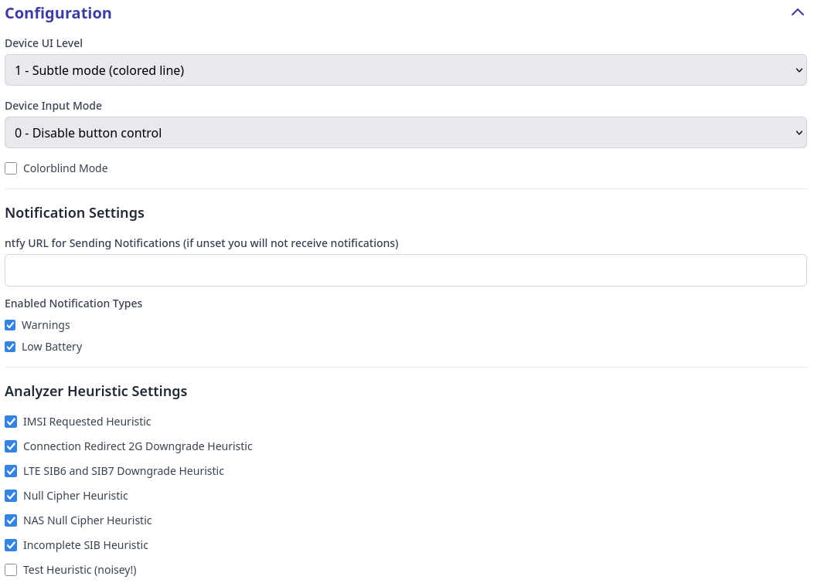

# Configuration

Rayhunter can be configured through web user interface or by editing `/data/rayhunter/config.toml` on the device.

Through web UI you can set:
- **Device UI Level**, which defines what Rayhunter shows on device's built-in screen. *Device UI Level* could be:
  - *Invisible mode*: Rayhunter does not show anything on the built-in screen
  - *Subtle mode (colored line)*: Rayhunter shows green line if there are no warnings, red line if there are warnings (warnings could be checked through web UI) and white line if Rayhunter is not recording.
  - *Demo mode (orca gif)*, which shows image of orcas *and* colored line.
  - *EFF logo*, which shows EFF logo *and* colored line.
  - *High visibility (full screen color)*: fills the entire screen with the status color (green for recording, red for warnings, white for paused).
- **Device Input Mode**, which defines behavior of built-in power button of the device. *Device Input Mode* could be:
  - *Disable button control*: built-in power button of the device is not used by Rayhunter.
  - *Double-tap power button to start/stop recording*: double clicking on a built-in power button of the device stops and immediately restarts the recording. This could be useful if Rayhunter's heuristics is triggered and you get the red line, and you want to "reset" the past warnings. Normally you can do that through web UI, but sometimes it is easier to double tap on power button.
- **Colorblind Mode** enables color blind mode (blue line is shown instead of green line, red line remains red). Please note that this does not cover all types of color blindness, but switching green to blue should be about enough to differentiate the color change for most types of color blindness.
- **ntfy URL**, which allows setting a [ntfy](https://ntfy.sh/) URL to which notifications of new detections will be sent. The topic should be unique to your device, e.g., `https://ntfy.sh/rayhunter_notifications_ba9di7ie` or `https://myserver.example.com/rayhunter_notifications_ba9di7ie`. The ntfy Android and iOS apps can then be used to receive notifications. More information can be found in the [ntfy docs](https://docs.ntfy.sh/).
- **Enabled Notification Types** allows enabling or disabling the following types of notifications:
  - *Warnings*, which will alert when a heuristic is triggered. Alerts will be sent at most once every five minutes.
  - *Low Battery*, which will alert when the device's battery is low. Notifications may not be supported for all devices—you can check if your device is supported by looking at whether the battery level indicator is functioning on the System Information section of the Rayhunter UI.
- With **Analyzer Heuristic Settings** you can switch on or off built-in [Rayhunter heuristics](heuristics.md). Some heuristics are experimental or can trigger a lot of false positive warnings in some networks (our tests have shown that some heuristics have different behavior in US or European networks). In that case you can decide whether you would like to have the heuristics that trigger a lot of false positives on or off. Please note that we are constantly improving and adding new heuristics, so a new release may reduce false positives in existing heuristics as well.

If you prefer editing `config.toml` file, you need to obtain a shell on your [Orbic](./orbic.md#obtaining-a-shell) or [TP-Link](./tplink-m7350.md#obtaining-a-shell) device and edit the file manually. You can view the [default configuration file on GitHub](https://github.com/EFForg/rayhunter/blob/main/dist/config.toml.in).
