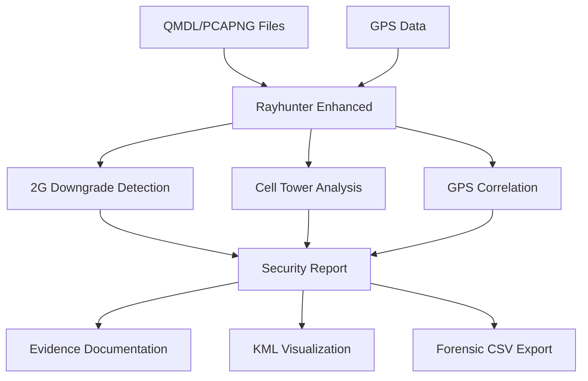

# Rayhunter Enhanced - Cellular Security Analysis Tool

[](https://opensource.org/licenses/MIT)
[](https://www.rust-lang.org)
[](https://github.com/EFForg/rayhunter)

## 🚨 **Critical Security Research Tool**

Rayhunter Enhanced is an advanced cellular network security analysis framework designed to detect sophisticated attacks on mobile communications, including:

- **2G Downgrade Attacks** (IMSI catchers)
- **Rogue Cell Tower Detection**
- **Man-in-the-Middle Cellular Attacks**
- **Network Spoofing Analysis**
- **GPS-Cellular Correlation Forensics**

## ⚠️ **Important Legal Notice**

This tool is designed for **legitimate security research**, **network defense**, and **authorized penetration testing** only. Users must:

- ✅ Have explicit permission to analyze cellular networks
- ✅ Comply with local telecommunications laws
- ✅ Use only for defensive security purposes
- ❌ **NOT** use for unauthorized interception or surveillance

**The authors are not responsible for misuse of this software.**

## 🎯 **Key Features**

### **Attack Detection Capabilities**
- **RRC Connection Release Detection** - Identifies forced 2G downgrades
- **SIB Manipulation Analysis** - Detects broadcast information tampering
- **Cell Tower Spoofing** - Identifies rogue cellular infrastructure
- **IMSI Catcher Detection** - Advanced fake base station identification

### **Advanced Analysis Tools**
- **SCAT Integration** - Professional QMDL file parsing
- **GPS Correlation** - Map cellular events to geographic locations
- **Multi-format Export** - KML, CSV, JSON, GPX output
- **Forensic Documentation** - Complete evidence chain preservation

### **Professional-Grade Parsing**
- **QMDL Analysis** - Qualcomm diagnostic message logs
- **NDJSON Processing** - Structured cellular data analysis
- **Raw Binary Parsing** - Low-level protocol inspection
- **Multi-tool Integration** - SCAT, custom analyzers

## 🚀 **Quick Start**

### **Prerequisites**
```bash
# Rust (latest stable)
curl --proto '=https' --tlsv1.2 -sSf https://sh.rustup.rs | sh

# Python 3.9+
python3 --version

# SCAT (Samsung Cellular Analysis Tool) - Optional but recommended
# Install from: https://github.com/fgsect/scat
```

### **Installation**
```bash
git clone https://github.com/[your-org]/rayhunter-enhanced.git
cd rayhunter-enhanced

# Build the main application
cargo build --release

# Install Python dependencies for analysis tools
pip3 install -r requirements.txt
```

### **Basic Usage**

#### **1. Detect 2G Downgrade Attacks**
```bash
# Analyze QMDL file for downgrade attacks
python3 tools/downgrade_analyzer.py --qmdl capture.qmdl --output analysis.json

# Generate reproducible report
python3 verify_downgrade_analysis.py
```

#### **2. Correlate with GPS Data**
```bash
# Correlate cellular observations with GPS coordinates
python3 tools/cell_gps_correlator.py \
    --gps locations.gps \
    --qmdl capture.qmdl \
    --output correlation.csv
```

#### **3. Advanced SCAT Analysis**
```bash
# Parse QMDL with professional SCAT tool
python3 tools/scat_cellular_parser.py \
    --scat-json scat_output.json \
    --output cellular_analysis.json
```

## 📊 **Analysis Workflow**



## 🛠️ **Advanced Tools**

### **Cellular Analysis Suite**
- `downgrade_analyzer.py` - 2G downgrade attack detection
- `cell_gps_correlator.py` - GPS-cellular correlation with SCAT integration
- `comprehensive_cellular_correlator.py` - Detailed cellular parameter extraction
- `scat_cellular_parser.py` - Professional SCAT output analysis
- `extract_cell_details.py` - Network identifier extraction

### **Forensic Documentation**
- `verify_downgrade_analysis.py` - Reproducible analysis verification
- Automated evidence chain preservation
- Complete technical documentation generation
- Multi-format export (JSON, CSV, KML, GPX)

## 📈 **Use Cases**

### **Security Research**
- Academic research on cellular security vulnerabilities
- Development of cellular attack detection systems
- Analysis of rogue base station behavior

### **Network Defense**
- Corporate security assessment of mobile infrastructure
- Detection of unauthorized cellular surveillance equipment
- Mobile network penetration testing

### **Digital Forensics**
- Investigation of cellular-based attacks
- Evidence collection for legal proceedings
- Technical analysis for law enforcement

## 🔧 **Configuration**

### **Environment Setup**
```bash
# Copy example configuration
cp config.example.json config.local.json

# Edit for your environment
vim config.local.json
```

### **SCAT Integration**
```bash
# Install SCAT for enhanced QMDL parsing
# Download from: https://github.com/fgsect/scat
# Update path in tools configuration
```

## 📖 **Documentation**

- [Installation Guide](doc/installation.md)
- [Analysis Methodology](doc/analyzing-a-capture.md)
- [Tool Configuration](doc/configuration.md)
- [API Documentation](GPS_API_DOCUMENTATION.md)
- [Security Research Guide](COMPREHENSIVE_CELLULAR_ANALYSIS_GUIDE.md)

## 🤝 **Contributing**

We welcome contributions from the security research community:

1. **Fork** the repository
2. **Create** a feature branch (`git checkout -b feature/amazing-detection`)
3. **Commit** your changes (`git commit -m 'Add amazing detection capability'`)
4. **Push** to the branch (`git push origin feature/amazing-detection`)
5. **Open** a Pull Request

### **Contribution Guidelines**
- Focus on **defensive security** capabilities
- Include comprehensive **documentation**
- Add **test cases** for new features
- Follow **responsible disclosure** practices

## 📄 **License**

This project is licensed under the MIT License - see the [LICENSE](LICENSE) file for details.

## 🔒 **Security Considerations**

### **Data Handling**
- **Never commit** real QMDL files or sensitive data
- **Sanitize** all example data before sharing
- **Use test data** for demonstrations and documentation

### **Responsible Use**
- **Obtain permission** before analyzing cellular networks
- **Report vulnerabilities** through proper channels
- **Respect privacy** and telecommunications regulations

## 🆘 **Support & Community**

- **Issues**: [GitHub Issues](https://github.com/[your-org]/rayhunter-enhanced/issues)
- **Discussions**: [GitHub Discussions](https://github.com/[your-org]/rayhunter-enhanced/discussions)
- **Security**: Report security issues privately to [security@yourorg.com]

## 🏆 **Acknowledgments**

- **EFF Rayhunter Team** - Original rayhunter project foundation
- **SCAT Developers** - Professional cellular analysis capabilities
- **Security Research Community** - Continued innovation in mobile security

---

**⚠️ Remember: Use responsibly and legally. This tool is for defensive security research only.**
