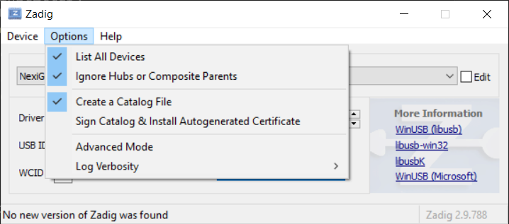
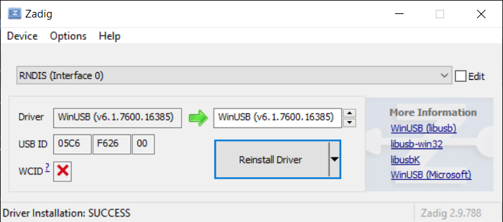

# Installing from the latest release (Windows)

Windows support in Rayhunter's installer is a work-in-progress. Depending on the device, the installation instructions differ.

## TP-Link

1. Insert a FAT-formatted SD card. This will be used to store all recordings.
2. Connect the device via WiFi or USB Tethering -- you should be able to view the TP-Link admin page on <http://192.168.0.1>.
3. Download the latest release (must be at least 0.3.0) for windows-x86_64, and unpack the zipfile.
4. Open PowerShell or CMD in that extracted folder, the installer: `./installer tplink`
5. Follow the instructions on the screen, if there are any.

## Orbic

<strong>

[The Windows USB installer is known to be buggy](https://github.com/EFForg/rayhunter/issues/366). We strongly recommend using the [Network-based installer](./orbic.md#the-network-installer).

</strong>

1. Connect the device to your computer using the provided USB cable.
1. Install the [Zadig WinUSB driver installer](https://zadig.akeo.ie/).
1. Open Zadig, click options->show all devices 

    

1. Select 'RNDIS (Interface 0)'

    

1. Click 'install driver' and wait for it to finish. 
2. Download the latest `rayhunter-vX.X.X-windows-x86_64.zip` from the [Rayhunter releases page](https://github.com/EFForg/rayhunter/releases). The version you download will have numbers instead of X
3. Unzip `rayhunter-vX.X.X-windows-x86_64` .
1. Open a powershell terminal by pressing Win+R and typing `powershell` and hitting enter. 
5. Type `cd ~\Downloads\rayhunter-v<x.x.x>-windows-x86_64` (**Replace <x.x.x> with the Rayhunter version you just unzipped**) and hit enter.
5. Run the install script: `.\installer.exe orbic` and hit enter.
    - The device will restart multiple times over the next few minutes.
    - You will know it is done when you see terminal output that says `checking for rayhunter server...success!`
6. Rayhunter should now be running! You can verify this by following the instructions below to [view the web UI](./using-rayhunter.md#the-web-ui). You should also see a green line flash along the top of top the display on the device.
