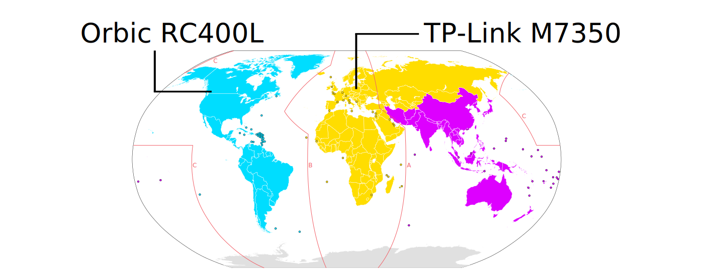

# Supported devices

Be sure to check your location's [supported frequencies](https://www.frequencycheck.com/) against a device page before obtaining a device.

## 1. Recommended devices
These devices have been extensively tested by the core developers and are widely used. **Use one of these devices if you can.**

| Device | Recommended region |
| ------ | ------ |
| [Orbic RC400L](./orbic.md) Sometimes also branded Kajeet RC400L | Americas |
| [TP-Link M7350](./tplink-m7350.md) | Africa, Europe, Middle East |

The TP-Link M7350 also works in the Americas but is usually more expensive.

_Derivative work of [this file](https://commons.wikimedia.org/wiki/File:International_Telecommunication_Union_regions_with_dividing_lines.svg) by [Maximillian Dörrbecker](https://de.wikipedia.org/wiki/User:Chumwa) licensed [CC BY-SA 2.5](https://creativecommons.org/licenses/by-sa/2.5)_

## 2. Functional devices
Rayhunter is confirmed to work on these devices.

| Device | Recommended region |
| ------ | ------ |
| [Wingtech CT2MHS01](./wingtech-ct2mhs01.md) | Americas |
| [Tmobile TMOHS1](./tmobile-tmohs1.md) | Americas |
| [TP-Link M7310](./tplink-m7310.md) | Africa, Europe, Middle East |
| [PinePhone and PinePhone Pro](./pinephone.md) | Global |
| [FY UZ801](./uz801.md) | Asia, Europe |
| [Moxee hotspot](./moxee.md) | Americas |
| [ZTE MF920V](./zte-mf920v.md) | Global |

## Adding new devices
Rayhunter was built and tested primarily on the Orbic RC400L mobile hotspot, but the community has been working hard at adding support for other devices. Theoretically, if a device runs a Qualcomm modem and exposes a `/dev/diag` interface, Rayhunter may work on it.

If you have a device in mind which you'd like Rayhunter to support, please [open a discussion on our Github](https://github.com/EFForg/rayhunter/discussions)!
