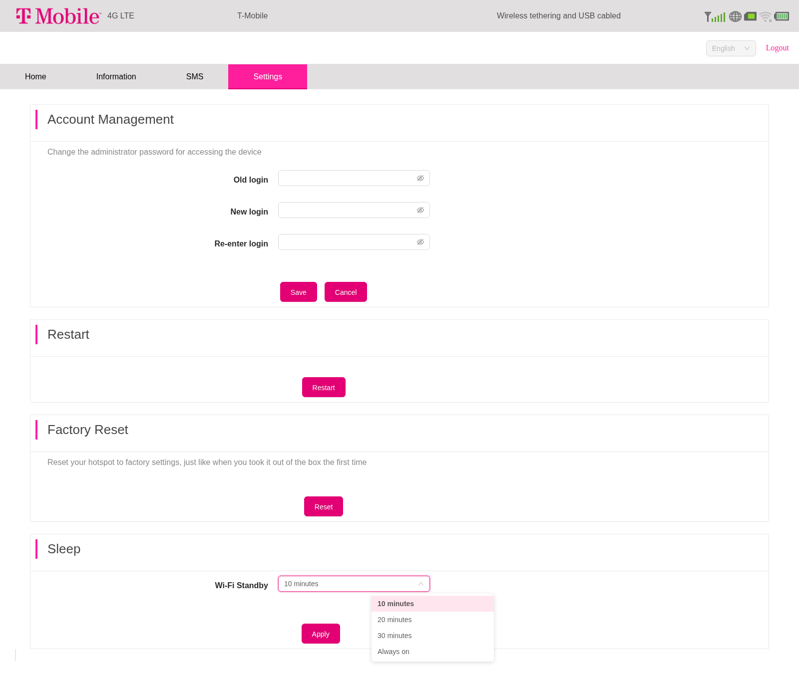

# Tmobile TMOHS1

The Tmobile TMOHS1 hotspot is a Qualcomm mdm9607-based device with many similarities to the Wingtech CT2MHS01 hotspot. The TMOHS1 has no screen, only 5 LEDs, two of which are RGB.

## Hardware
Cheap used versions of the device can be found easily on Ebay, and also from these sellers:
- <https://www.amazon.com/T-Mobile-TMOHS1-Portable-Hotspot-Connect/dp/B0CD9MX232>
- <https://www.walmart.com/ip/T-Mobile-TMOHS1-Portable-Internet-4G-LTE-WIFI-Hotspot/3453542421>
- <https://www.metrobyt-mobile.com/hotspot-iot-connected-devices/t-mobile-hotspot>

Rayhunter has been tested on:

```sh
WT_INNER_VERSION=SW_Q89527AA1_V045_M11_TMO_USR_MP
WT_PRODUCTION_VERSION=TMOHS1_00.05.20
WT_HARDWARE_VERSION=89527_1_11
```

Please consider sharing the contents of your device's /etc/wt_version file here.

## Supported bands

The TMOHS1 is primarily an ITU Region 2 device, although Bands 5 (CLR) and 41 (BRS) may be suitable for roaming in Region 3.

According to FCC ID 2APXW-TMOHS1 Test Report No. I20Z61602-WMD02 ([part 1](https://fcc.report/FCC-ID/2APXW-TMOHS1/4987033.pdf), [part 2](https://fcc.report/FCC-ID/2APXW-TMOHS1/4987034.pdf)), the TMOHS1 supports the following LTE bands:

| Band | Frequency        |
| ---- | ---------------- |
|    2 | 1900 MHz (PCS)   |
|    4 | 1700 MHz (AWS-1) |
|    5 | 850 MHz (CLR)    |
|   12 | 700 MHz (LSMH)   |
|   25 | 1900 MHz (E-PCS) |
|   26 | 850 MHz (E-CLR)  |
|   41 | 2500 MHz (BRS)   |
|   66 | 1700 MHz (E-AWS) |
|   71 | 600 MHz (USDD)   |

## Installing
Connect to the TMOHS1's network over WiFi or USB tethering.

The device will not accept web requests until after the default password is changed.
If you have not previously logged in, log in using the default password printed under the battery and change the admin password.

Then run the installer:

```sh
./installer tmobile --admin-password Admin0123! # replace with your own password
```

## LED modes
| Rayhunter state  | LED indicator                  |
| ---------------- | ------------------------------ |
| Recording        | Signal LED slowly blinks blue. |
| Paused           | WiFi LED blinks white.         |
| Warning Detected | Signal LED slowly blinks red.  |

## Wi-Fi auto-shutdown

By default the TMOHS1 turns off its Wi-Fi access point after 10 minutes with no connected clients. Rayhunter keeps recording on the device in the background, but once the access point is down you can't reach the web UI, download captures, or see new warnings until you power cycle the hotspot.

The TMOHS1's native admin UI lets you change this:

1. Connect to the TMOHS1's Wi-Fi (or USB tether).
2. In a browser open `http://192.168.0.1/` and log in with the admin password.
3. Go to **Settings** → **Sleep** → **Wi-Fi Standby** and pick **Always on**.
4. Click **Apply**.



Keeping Wi-Fi always on uses more battery. If you only monitor Rayhunter through the device's LEDs and don't need remote access, the default 10-minute timer is fine.

## Obtaining a shell
Even when rayhunter is running, for security reasons the TMOHS1 will not have telnet or adb enabled during normal operation.

Use either command below to enable telnet or adb access:

```sh
./installer util tmobile-start-telnet --admin-password Admin0123!
telnet 192.168.0.1
```

```sh
./installer util tmobile-start-adb --admin-password Admin0123!
adb shell
```
