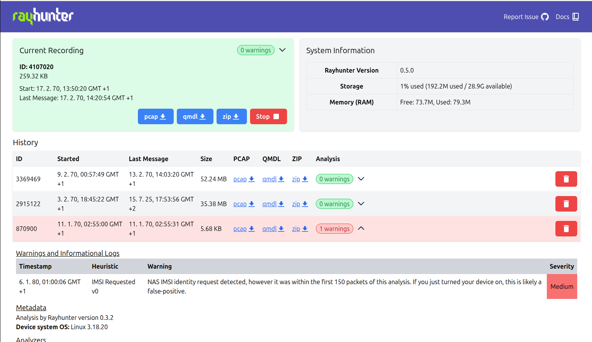

# Using Rayhunter

Once installed, Rayhunter will run automatically whenever your device is running. You'll see a green line on top of the device's display to indicate that it's running and recording. [The line will turn yellow dots, orange dashes, or solid red](./faq.md#red) once a potential IMSI catcher has been found, depending on the severity of the alert, until the device is rebooted or a new recording is started through the web UI.

It also serves a web UI that provides some basic controls, such as being able to start/stop recordings, download captures, delete captures, and view heuristic analyses of captures.

## The web UI

You can access this UI in one of two ways:

* **Connect over WiFi:** Connect your phone/laptop to your device's WiFi
  network and visit <http://192.168.1.1:8080> (orbic)
  or <http://192.168.0.1:8080> (tplink).

  Click past your browser warning you about the connection not being secure, Rayhunter doesn't have HTTPS yet.

  On the **Orbic**, you can find the WiFi network password by going to the Orbic's menu > 2.4 GHz WIFI Info > Enter > find the 8-character password next to the lock 🔒 icon.
  On the **TP-Link**, you can find the WiFi network password by going to the TP-Link's menu > Advanced > Wireless > Basic Settings.

* **Connect over USB (Orbic):** Connect your device to your laptop via USB. Run `adb forward tcp:8080 tcp:8080`, then visit <http://localhost:8080>.
    * For this you will need to install the Android Debug Bridge (ADB) on your computer, you can copy the version that was downloaded inside the `releases/platform-tools/` folder to somewhere else in your path or you can install it manually.
    * You can find instructions for doing so on your platform [here](https://www.xda-developers.com/install-adb-windows-macos-linux/#how-to-set-up-adb-on-your-computer), (don't worry about instructions for installing it on a phone/device yet).
    * On MacOS, the easiest way to install ADB is with Homebrew: First [install Homebrew](https://brew.sh/), then run `brew install android-platform-tools`.

* **Connect over USB (TP-Link):** Plug in the TP-Link and use USB tethering to establish a network connection. ADB support can be enabled on the device, but the installer won't do it for you.

## Key shortcuts

As of Rayhunter version 0.3.3, you can start a new recording by double-tapping the power button. Any current recording will be stopped and a new recording will be started, resetting the red line as well. This feature is disabled by default since Rayhunter version 0.4.0 and needs to be enabled through [configuration](./configuration.md).
